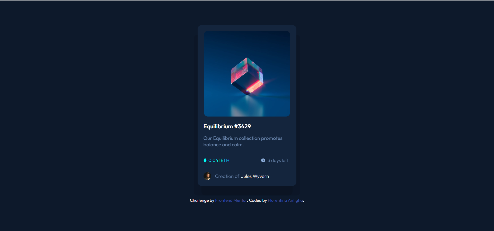

# Frontend Mentor - NFT preview card component solution

This is a solution to the [NFT preview card component challenge on Frontend Mentor](https://www.frontendmentor.io/challenges/nft-preview-card-component-SbdUL_w0U). Frontend Mentor challenges help you improve your coding skills by building realistic projects. 

## Table of contents

- [Overview](#overview)
  - [The challenge](#the-challenge)
  - [Screenshot](#screenshot)
- [My process](#my-process)
  - [Built with](#built-with)
  - [What I learned](#what-i-learned)
  - [Continued development](#continued-development)
- [Author](#author)


## Overview

### The challenge

Users should be able to:

- View the optimal layout depending on their device's screen size
- See hover states for interactive elements

### Screenshot



## My process

### Built with

  - Semantic HTML5 markup
  - CSS custom properties
  - Flexbox
  - Media Queries

### What I learned

```css
.equilibrium::after {
      content: "";
      cursor: pointer;
      position: absolute;
      justify-content: center;
      width: 87%;
      height: 100%;
      background-color: hsla(178, 100%, 50%, 0.5); 
      border-radius: 10px;
      background-image: url("images/icon-view.svg");
      background-repeat: no-repeat;
      background-position-x: center;
      background-position-y: center;
      background-size: 37px 37px;
      opacity: 0;
      transition: opacity 0.3s ease;
    }
    .equilibrium:hover::after {
      opacity: 1;
    }
```

### Continued development

I will continue to develop myself on building websites with javascript frameworks and master them eventually.

## Author

- Frontend Mentor - [@Floren-teena](https://www.frontendmentor.io/profile/Floren-teena)
